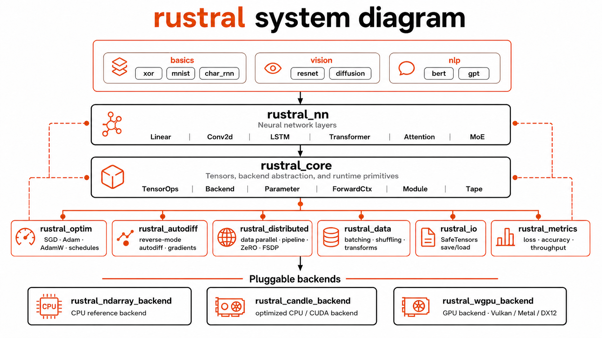
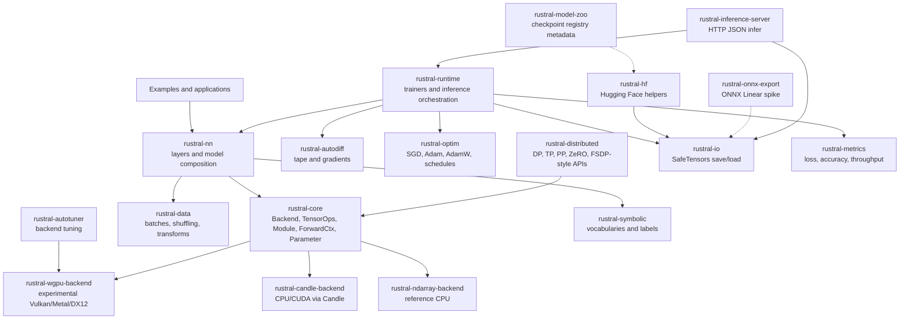
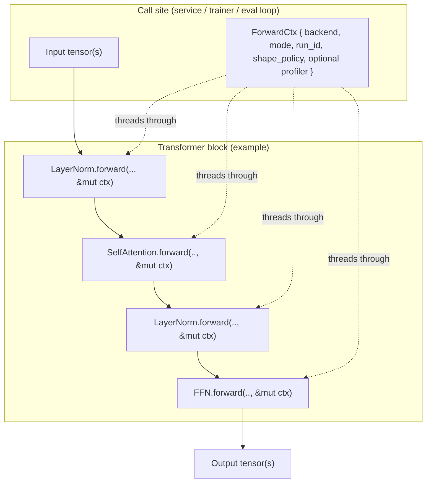

# Rustral

> **A Rust neural network framework for learning, research, and experiments**

<p align="center">
  
</p>

[](https://www.rust-lang.org)
[](LICENSE-MIT)

## What is Rustral?

**Rustral** is a deep learning toolkit in Rust for building and training neural networks, from small tutorials to transformers and mixture-of-experts experiments.

Rustral is not trying to be a Python framework with Rust syntax. It is built around a different set of engineering bets:

- **Explicit execution state.** A `ForwardCtx` carries backend, mode, run id, optional shape hints ([`ShapePolicy`](crates/core/src/shape_policy.rs)), and an optional [`OperationProfiler`](crates/core/src/operation_profiler.rs) through the call graph. Model code does not depend on hidden global tensor registries or implicit training modes.
- **Backend-independent model definitions.** Layers are written against small backend traits, so the same model can run on the reference CPU backend, Candle, or experimental `wgpu` without rewriting the layer stack.
- **Typed model boundaries.** The `Module` trait makes input and output contracts visible in Rust types. This is useful when experiments grow from one-off notebooks into reusable systems.
- **Inspectable internals.** Autodiff, optimizers, layers, distributed training hooks, and runtime orchestration live in focused crates. The framework is meant to be read, modified, and audited.
- **Rust-native deployment paths.** Trained logic can be compiled into ordinary Rust binaries and services, which reduces the gap between experiment code and production code.
- **Evidence you can rerun.** Real-corpus NLP examples, schema-checked benchmark JSON, CI artifacts, and release snapshots are part of the repo, not a separate private workflow.

The intended user experience is simple: define a model with normal Rust structs, choose a backend once, run forward passes through an explicit context, then keep the same model shape as you move from tutorials to training loops, checkpointing, and inference.

### Who is it for?

- **Students** learning how networks work under the hood
- **Researchers** who want reproducible, typed model code
- **Engineers** experimenting with Rust-native ML pipelines

---

## Design Philosophy

Rustral favors explicit structure over framework magic. That choice creates more visible code than a notebook-first API, but it also gives senior engineers and ML researchers stronger control over correctness, reproducibility, and system behavior.

### The Core Tradeoff

Most deep learning frameworks optimize for interactive velocity: global tensor state, dynamic graph construction, runtime shape failures, and large native backends hidden behind Python objects. That model is productive, but it makes many production and research questions harder to reason about:

- Which backend owns this tensor?
- Which parameters are trainable in this pass?
- Where does graph lifetime begin and end?
- What does a model need to run outside the training process?
- Can this layer be reused without inheriting hidden runtime state?

Rustral makes those boundaries explicit. The result is a framework where model code is more portable across backends, easier to test at crate boundaries, and easier to integrate into Rust systems that already care about memory safety, concurrency, deployment, and reproducible builds.

### Ease Of Use, Not Hidden State

Rustral treats ease of use as a systems problem: the common path should be short, but the important state should still be visible when something goes wrong.

| User need | Rustral design choice |
|-----------|-----------------------|
| Build a layer without boilerplate | Builders such as `LinearBuilder` initialize backend-owned parameters for you. |
| Run the same model on another backend | Model code depends on `Backend` and `TensorOps`, not a concrete tensor library. |
| Know whether a pass is training or inference | `ForwardCtx` carries `Mode::Train` or `Mode::Inference` explicitly. |
| Compose larger models from smaller pieces | `Module` gives each layer a typed forward contract. |
| Inspect, test, or replace internals | Autodiff, optimizers, runtime, data, and backends are separate crates. |
| Move toward deployment | Rust binaries can embed the same model logic used in experiments. |

The design is intentionally not "magic-free at any cost." The goal is to put convenience at the edges through builders, trainers, examples, and checkpoint helpers while keeping ownership, backend selection, and execution mode clear in the core API.

### Practical Advantages

| Advantage | Why it matters |
|-----------|----------------|
| Explicit `ForwardCtx` | Training/inference mode, backend access, and run state are visible at every forward pass. |
| Small backend contract | New execution engines can be added without changing high-level model definitions. |
| Reference CPU backend | Correctness can be tested on a simple backend before optimizing for CUDA or cross-platform GPU paths. |
| Focused crates | Researchers can study or replace autodiff, optimizers, layers, runtime, data, or distributed pieces independently. |
| Rust ownership model | Parameter ownership, borrowing, and lifetimes are checked by the compiler instead of convention. |
| Single-binary integration | Inference and training utilities can be embedded into normal Rust services, CLIs, and pipelines. |

### What Rustral Optimizes For

- Clear extension points for new layers, backends, optimizers, and training loops.
- Reproducible experiments that can move from research code into systems code.
- Debuggable internals for people who want to understand or modify the framework.
- Correctness-first CPU execution with optional faster backend paths.
- A workspace architecture where each subsystem can be tested and evolved independently.

### Device-Agnostic Optimizations

Rustral includes cross-backend optimization infrastructure that works uniformly across CPU, CUDA, Metal, and future backends:

**Capability Detection**
- Each backend reports its hardware capabilities (FP16/BF16 support, tensor cores, optimal batch sizes)
- Callers can use helpers such as [`BackendCapabilities::clamp_batch_size`](crates/core/src/backend.rs) as a soft batch-size hint
- Many capability fields are still **advisory** (documented in [`ARCHITECTURE.md`](ARCHITECTURE.md)); not every flag drives behavior yet
- Automatic fallback to conservative defaults for unknown devices

**Performance Profiling**
- `OperationProfiler` tracks timing statistics for all tensor operations
- Cross-backend performance comparison and regression detection
- Hot path identification for optimization focus

**Memory Management**
- `TensorPool` reduces allocation overhead through shape-based pooling
- [`PoolStrategy`](crates/core/src/tensor_pool.rs) (including `TrainingArena` with `begin_step` clears) for training vs inference reuse hints
- Automatic size filtering to avoid pooling very large or very small tensors
- Configurable limits to prevent memory bloat

**Memory Profiling**
- `MemoryProfiler` tracks allocation patterns and detects memory leaks
- OOM risk prediction based on current memory trajectory
- Per-tag memory usage analysis for optimization insights

**Operation Fusion**
- `FusionOps` trait enables backend-specific fused kernel implementations
- [`FusionOptimizer::apply_*`](crates/core/src/fusion.rs) and [`FusionHelper`](crates/nn/src/fusion_helper.rs) share one try-fused-then-fallback policy for linear + bias (+ activation)
- `LinearReLU` and `LinearGELU` delegate to that path; tape training uses separate per-op `Tape` nodes (including `Tape::gelu` for transformer FFNs)
- Reduces memory traffic and kernel launch overhead on capable backends
- Currently implemented in candle-backend with sequence-level fusion (true single-kernel fusion remains roadmap work)

**Numerics**
- [`NumericsConfig`](crates/core/src/numerics.rs) / [`FusionTestHarness`](crates/core/src/fusion_tests.rs) support comparing fused vs unfused paths within dtype tolerances

These optimizations are designed to benefit all backends equally, maintaining Rustral's commitment to device-agnostic performance improvements.

Rustral is currently best viewed as a research and systems framework: useful for learning, experiments, backend work, and Rust-native ML infrastructure. If you need the largest pretrained model ecosystem today, Python frameworks remain the practical default. If you want a framework whose execution model is explicit and whose internals are approachable, Rustral is designed for that.

The public roadmap lives in [`docs/master-plan.md`](docs/master-plan.md). Detailed execution plans are tracked in [`IMPROVEMENT_PLAN.md`](IMPROVEMENT_PLAN.md).

## Why Rustral Feels Different

Rustral's edge is **modular ML systems code with light syntax around the common path**:

- Model code is written once against `Backend`, then run on ndarray, Candle, or experimental `wgpu` backends.
- Execution state is explicit through `ForwardCtx` (mode, run id, optional `ShapePolicy` and profiler), so training/inference mode does not hide in globals.
- Layers are normal Rust structs, but builders remove most parameter-initialization boilerplate.
- Internals are split into crates, so researchers can inspect or replace autodiff, optimizers, IO, runtime, or backends independently.

### Same Tiny Model, Different Stacks

**PyTorch: concise, dynamic, global runtime conventions**

```python
import torch
import torch.nn as nn

model = nn.Sequential(
    nn.Linear(2, 4),
    nn.ReLU(),
    nn.Linear(4, 1),
    nn.Sigmoid(),
)

x = torch.tensor([[0.0, 1.0]])
y = model(x)
```

PyTorch is the fastest path for interactive research and ecosystem access. The tradeoff is that device placement, training mode, parameter ownership, and graph behavior are mostly runtime conventions.

**Candle direct: fast Rust tensor library, model plumbing stays close to tensors**

```rust
use candle_core::{DType, Device, Tensor};
use candle_nn::{linear, Module, VarBuilder, VarMap};

let device = Device::Cpu;
let varmap = VarMap::new();
let vb = VarBuilder::from_varmap(&varmap, DType::F32, &device);
let l1 = linear(2, 4, vb.pp("l1"))?;
let l2 = linear(4, 1, vb.pp("l2"))?;

let x = Tensor::from_vec(vec![0.0f32, 1.0], (1, 2), &device)?;
let y = l2.forward(&l1.forward(&x)?.relu()?)?.sigmoid()?;
```

Candle is excellent when you want a practical Rust tensor engine. Rustral can use Candle as a backend while keeping model code behind Rustral's `Module` and `ForwardCtx` contracts.

**Rustral: backend-generic model code with explicit execution context**

```rust
use rustral_core::{Backend, ForwardCtx, Mode, Module};
use rustral_nn::{Linear, LinearBuilder};

struct TinyMlp<B: Backend> {
    l1: Linear<B>,
    l2: Linear<B>,
}

impl<B: Backend> TinyMlp<B> {
    fn new(backend: &B) -> rustral_core::Result<Self> {
        Ok(Self {
            l1: LinearBuilder::new(2, 4).with_bias(true).build(backend)?,
            l2: LinearBuilder::new(4, 1).with_bias(true).build(backend)?,
        })
    }

    fn forward(&self, x: B::Tensor, ctx: &mut ForwardCtx<B>) -> rustral_core::Result<B::Tensor> {
        let ops = ctx.backend().ops();
        let h = self.l1.forward(x, ctx)?;
        let h = ops.relu(&h)?;
        let y = self.l2.forward(h, ctx)?;
        ops.sigmoid(&y)
    }
}
```

The syntax is still Rust, but the repeated decisions are handled for you: parameter initialization goes through builders, execution state goes through `ForwardCtx`, and backend-specific tensor work stays behind `TensorOps`.

### Backend Swap Without Rewriting The Model

```rust
use rustral_core::{Backend, ForwardCtx, Mode};
use rustral_ndarray_backend::CpuBackend;
use rustral_candle_backend::CandleBackend;

fn run<B: Backend>(backend: &B) -> rustral_core::Result<B::Tensor> {
    let model = TinyMlp::new(backend)?;
    let input = backend.tensor_from_vec(vec![0.0, 1.0], &[1, 2])?;
    let mut ctx = ForwardCtx::new(backend, Mode::Inference);
    model.forward(input, &mut ctx)
}

let _reference = run(&CpuBackend::default())?;
let _fast_cpu = run(&CandleBackend::cpu())?;
```

This is the design center: use the CPU reference backend for correctness, switch to Candle for practical execution, and keep the model definition stable.

### Where Rustral Is Better, And Where It Is Not

| Stack | Best at | Tradeoff | Rustral advantage |
|-------|---------|----------|-------------------|
| PyTorch | ecosystem, pretrained models, notebooks, mature autograd | runtime conventions and Python/C++ boundary | Rust-native deployment, explicit context, auditable internals |
| JAX | transforms, compilation, accelerator research | XLA-oriented mental model, Python-first | simpler explicit systems model for Rust applications |
| Candle | practical Rust tensor execution and model loading | lower-level model/runtime orchestration | Rustral can use Candle as a backend while adding typed modules, trainers, IO, and explicit context |
| Burn | high-level Rust deep learning ergonomics | larger framework surface and its own abstractions | Rustral stays small, inspectable, and backend-contract focused |
| Rustral | modularity, explicit state, backend swapping, readable internals | younger ecosystem, fewer kernels, fewer pretrained workflows | strongest fit for learning, ML systems research, and Rust-native pipelines |

## Quick Start (5 Minutes)

### 1. Installation

```bash
# Install Rust (if you haven't)
curl --proto '=https' --tlsv1.2 -sSf https://sh.rustup.rs | sh

# Clone Rustral
git clone https://github.com/skumyol/rustral.git
cd rustral

# Build everything (takes ~5 min on modern hardware)
cargo build --workspace
```

### 2. Run the Test Suite

```bash
./run_tests.sh
```

This runs formatting checks, clippy lints, the full workspace build, and tests across workspace crates (`rustral-wgpu-backend` may warn on some GPU/driver stacks). Newer crates include `rustral-inference-server`, `rustral-model-zoo`, and `rustral-onnx-export`; see [Inference, checkpoints, and deployment](#inference-checkpoints-and-deployment).

### 3. Run Your First Example: XOR Classification

```bash
cargo run -p rustral-runtime --features training --example tape_xor_classification
```

**What it does:** A 2-layer network learns that `0 XOR 0 = 0`, `0 XOR 1 = 1`, `1 XOR 0 = 1`, `1 XOR 1 = 0`.

**Why this matters:** XOR is not linearly separable. You need at least one hidden layer. This proves the network actually learns something non-trivial.

### 4. Run a Tape-Based Training Demo (MSE Regression)

```bash
cargo run -p rustral-runtime --features training --example tape_train_demo
```

This uses the generic tape trainer (`TapeTrainer`) plus the model-level save/load helpers (`save_model` / `load_model`) are available under the same `training` feature.

### 4b. Live Terminal Dashboard

Every training example with `--features training` now **automatically spawns a live terminal dashboard** showing:

- **Progress bars**: Epoch and batch progress with percentage
- **Metrics**: Live loss, accuracy, and learning rate display with a Sparkline mini-chart
- **Memory**: Current/peak memory usage, OOM risk color indicator (green→yellow→red), allocation counts
- **Leak detection**: Real-time memory leak warnings with tag, bytes, and allocation count
- **Loss safety**: Automatic NaN/Inf detection and sustained spike warnings
- Alerts footer with color-coded critical warnings

Press `q` to exit the dashboard. Training continues normally in the background.

```bash
cargo run -p rustral-runtime --features training --example tape_xor_classification
```

No user code changes needed. The dashboard integrates natively into `TapeTrainer::fit()` and `fit_classification()`.

### 5. Run a Real-Corpus NLP Example

```bash
# SST-2 sentiment classifier, reports dev accuracy and writes manifest.json
cargo run --release -p rustral-runtime --features training --example sst2_classifier -- --quick

# WikiText-2 word-level LM, reports dev perplexity and writes manifest.json
cargo run --release -p rustral-runtime --features training --example wikitext2_lm -- --quick
```

These are intentionally small CPU-friendly baselines. They are not SOTA models, but they are real datasets, real metrics, and reproducible run artifacts. See [`EVALUATION.md`](EVALUATION.md).

### 6. Run a Transformer Example

```bash
cargo run -p rustral-nn --example linear_readout
cargo run -p rustral-nn --example transformer_bert_encoder
```

### 7. Run the Benchmark Harness

```bash
# CPU backend matrix, schema-v2 JSON, summary table
python3 scripts/bench/run_all.py --suite rustral --suite candle --repeats 3 --warmup 1

# Optional PyTorch comparison, requires torch in your Python environment
python3 scripts/bench/run_all.py --suite rustral --suite candle --suite pytorch
```

The harness writes `benchmarks/results/<timestamp>.json` and `benchmarks/results/summary.md`. CI validates the JSON schema and uploads CPU benchmark artifacts for every PR. See [`BENCHMARKS.md`](BENCHMARKS.md).

### 8. HTTP inference server (optional)

Train a tiny linear, write a Safetensors artifact, and serve JSON inference:

```bash
cargo run -p rustral-runtime --features training --example save_linear_artifact -- tiny_linear.safetensors
cargo run -p rustral-inference-server -- \
  --artifact tiny_linear.safetensors --bind 127.0.0.1:8080 --in-features 1 --out-features 1 --bias
# curl http://127.0.0.1:8080/health
# curl -s -X POST http://127.0.0.1:8080/v1/infer -H 'content-type: application/json' -d '{"input":[[0.25]]}'
```

Production-oriented notes: [`crates/inference-server/DEPLOYMENT.md`](crates/inference-server/DEPLOYMENT.md) (nginx, Kubernetes probes, Prometheus `/metrics`, Docker). ONNX export (single Linear spike): [`docs/export-onnx-torchscript.md`](docs/export-onnx-torchscript.md). Curated checkpoint metadata: [`crates/model-zoo/README.md`](crates/model-zoo/README.md).

---

## Inference, checkpoints, and deployment

Rustral’s training story already includes **strict** whole-model I/O via `rustral-runtime` (`save_model` / `load_model` / `*_from_path`) keyed by `NamedParameters`. Recent work adds **ecosystem-facing** pieces:

| Piece | Crate / doc | Role |
|-------|-------------|------|
| Model zoo registry | [`rustral-model-zoo`](crates/model-zoo) | Machine-readable list of workflows and Hub-related notes (not weight hosting). |
| HTTP inference MVP | [`rustral-inference-server`](crates/inference-server) | Axum service: `/health`, `/ready`, `/v1/infer`, `/metrics`, graceful shutdown. |
| ONNX export (spike) | [`rustral-onnx-export`](crates/onnx-export) | Emit a minimal Linear graph (`MatMul` + `Add`) for external runtimes. |
| Wasm / mobile guidance | [`docs/wasm-wgpu-inference.md`](docs/wasm-wgpu-inference.md), [`docs/mobile-deployment.md`](docs/mobile-deployment.md) | Scope and limitations for browser and native apps. |

Track H status and phases: [`docs/master-plan.md`](docs/master-plan.md) (deployment ecosystem section).

---

## Architecture

Rustral is organized as a workspace of focused crates. Each crate handles one piece of the puzzle:

<p align="center">
  
</p>



```text
examples and applications
  -> rustral-nn
     neural network layers: Linear, Conv2d, LSTM, Transformer, Attention, MoE
  -> rustral-core
     TensorOps, Backend, Parameter, Module, ForwardCtx
  -> training and runtime crates
     rustral-autodiff, rustral-optim, rustral-runtime, rustral-distributed
  -> backend crates
     rustral-ndarray-backend, rustral-candle-backend, rustral-wgpu-backend
```

| Layer | Crates | Responsibility |
|-------|--------|----------------|
| Model surface | `examples`, `rustral-nn` | User-facing layers, model composition, transformer and vision examples |
| Core contracts | `rustral-core` | Tensor operations, backend trait, parameters, module trait, explicit forward context |
| Training stack | `rustral-autodiff`, `rustral-optim`, `rustral-runtime` | Gradients, optimizers, mixed precision hooks, trainer and inference orchestration |
| Scaling stack | `rustral-distributed` | Data, tensor, pipeline, sequence, context, ZeRO, and FSDP-style parallelism APIs |
| Execution backends | `rustral-ndarray-backend`, `rustral-candle-backend`, `rustral-wgpu-backend` | Reference CPU, optimized CPU/CUDA, and experimental cross-platform GPU execution |
| Supporting crates | `rustral-data`, `rustral-io`, `rustral-metrics`, `rustral-autotuner`, `rustral-symbolic`, `rustral-hf`, `rustral-tui`, `rustral-model-zoo`, `rustral-onnx-export`, `rustral-inference-server` | Data loading, checkpoints, metrics, tuning, vocabularies, Hub helpers, TUI dashboard, curated model registry metadata, experimental ONNX export, HTTP inference service |

### Crate-by-Crate Breakdown

| Crate | What It Does |
|-------|-------------|
| `rustral_core` | **Tensors, backends, and the `Module` trait**, the foundation everything builds on |
| `rustral_nn` | **Neural network layers**: Linear, Conv2d, LSTM, Transformer, Attention, MoE, Flash Attention |
| `rustral_autodiff` | **Automatic differentiation**, computes gradients via reverse-mode autodiff |
| `rustral_optim` | **Optimizers**: SGD, Adam, AdamW + learning rate schedules + mixed precision |
| `rustral_distributed` | **Parallel training APIs** (ZeRO/FSDP-style sharding, threading/MPI hooks; see docs for current scope) |
| `rustral_data` | **Data loading**: batching, shuffling, transforms |
| `rustral_io` | **Save/load models** in SafeTensors format |
| `rustral_wgpu_backend` | **Experimental GPU** via WebGPU (Vulkan/Metal/DX12), see **Backends** |
| `rustral_candle_backend` | **Optimized CPU/CUDA/Metal backend** using candle-core (up to ~20x faster than ndarray on CPU) |
| `rustral_ndarray_backend` | **Reference CPU backend** for correctness testing |
| `rustral_metrics` | **Track training**: loss curves, accuracy, throughput |
| `rustral_autotuner` | **Automatically find the fastest GPU settings** |
| `rustral_symbolic` | **Vocabulary and label dictionaries** for NLP tasks |
| `rustral_bench` | **Benchmark harness** for schema-v2 JSON, backend comparison, train-step workloads, GPU suites, and Criterion microbenches |
| `rustral_runtime` | **Training/inference orchestration** (trainers, pools) |
| `rustral_tui` | **Live terminal dashboard** for training — auto-spawns progress bars, metrics, memory monitoring, and leak detection |
| `rustral_hf` | **Optional Hugging Face Hub** helpers for weights |
| `rustral_model_zoo` | **Registry metadata** for documented checkpoints and workflows (`registry.json` + HF name-mapping notes) |
| `rustral_onnx_export` | **Experimental ONNX** export for a single Linear layer (external runtime interop) |
| `rustral_inference_server` | **HTTP JSON inference** binary (MVP: one `Linear`; metrics and Docker in crate docs) |

### Backends

Rustral is designed to be backend-agnostic. You can swap backends without changing your model code:

```rust
use rustral_ndarray_backend::CpuBackend;      // Reference CPU backend
use rustral_candle_backend::CandleBackend;    // Optimized CPU/CUDA
use rustral_wgpu_backend::WgpuBackend;        // Cross-platform GPU

// All three work with the same model code
let backend = CpuBackend::default();
// let backend = CandleBackend::cpu();
// let backend = WgpuBackend::new_sync()?;
```

| Backend | Hardware | Best For | Status |
|---------|----------|----------|--------|
| `rustral-ndarray-backend` | CPU | Reference/testing, correctness baselines | Stable |
| `rustral-candle-backend` | CPU, CUDA (optional), Metal (optional) | Production training, large models, backend-matrix benchmarks | Stable |
| `rustral-wgpu-backend` | GPU (Vulkan/Metal/DX12) | Experiments / inference prototyping | **Experimental** |

\* **Experimental:** uses WGSL compute for matmul, element-wise ops, etc. On some Linux + NVIDIA stacks, full test binaries have aborted during teardown (allocator/driver interaction with `wgpu` 0.19). CI runs these tests as non-blocking; use Candle for reliable GPU-ish throughput until `wgpu` is upgraded.

---

## Core Concepts

### 1. Tensors

A **tensor** is a multi-dimensional array of numbers:

- **0D**: Scalar → `5.0`
- **1D**: Vector → `[0.1, 0.5, 0.9]`
- **2D**: Matrix → `[[1, 2], [3, 4]]`
- **3D+**: Stack of matrices → batch of images `[batch, channels, height, width]`

```rust
let data = vec![1.0, 2.0, 3.0,   // Sample 1
                4.0, 5.0, 6.0];  // Sample 2
let tensor = backend.tensor_from_vec(data, &[2, 3]).unwrap();
```

### 2. The Module Trait

Every layer implements `Module`, a simple contract:

```rust
pub trait Module<B: Backend> {
    type Input;
    type Output;
    fn forward(&self, input: Self::Input, ctx: &mut ForwardCtx<B>) -> Result<Self::Output>;
}
```

This means you can swap a `Linear` for a `Conv2d` and the rest of your code doesn't change.

### 3. Forward Context

Unlike PyTorch's hidden global state, rustral makes everything explicit:

```rust
let mut ctx = ForwardCtx::new(&backend, Mode::Inference);
let output = layer.forward(input, &mut ctx)?;
```

You can run two models simultaneously without interference.

### 4. Bulk Tensor Access

For GPU backends, reading data element-by-element is slow (each call may round-trip to the GPU). Use `tensor_to_vec` for bulk reads:

```rust
// Slow on GPU: one roundtrip per element
for i in 0..n {
    let val = ops.tensor_element(&tensor, i)?;
}

// Fast on GPU: single roundtrip for all elements
let values = ops.tensor_to_vec(&tensor)?;
```

This is especially important for layers like `Conv2d` and normalization that need to access many values.

---

## Examples Gallery

Runnable demos are split by crate:

- **[`crates/runtime/examples/`](crates/runtime/examples/)** — training loops, real NLP corpora, tape XOR, fusion/mixed-precision demos (`rustral-runtime` with `--features training`).
- **[`crates/nn/examples/`](crates/nn/examples/)** — layer and model recipes: XOR, MNIST, vision, transformers, MoE (`rustral-nn`).
- **[`examples/`](examples/)** — **pointer workspace only** (placeholder binary so `cargo build --manifest-path examples/Cargo.toml` stays green). See [`examples/README.md`](examples/README.md).

### Training and NLP (`rustral-runtime`)

| Example | Run command |
|---------|-------------|
| Tape training demo | `cargo run -p rustral-runtime --features training --example tape_train_demo` |
| Tape XOR classification | `cargo run -p rustral-runtime --features training --example tape_xor_classification` |
| Save linear artifact (inference server) | `cargo run -p rustral-runtime --features training --example save_linear_artifact` |
| EMNLP char LM | `cargo run -p rustral-runtime --features training --example emnlp_char_lm` |
| SST-2 classifier | `cargo run --release -p rustral-runtime --features training --example sst2_classifier -- --quick` |
| WikiText-2 word LM | `cargo run --release -p rustral-runtime --features training --example wikitext2_lm -- --quick` |
| Advanced optimizations | `cargo run -p rustral-runtime --features training --example advanced_optimizations` |
| Backend-agnostic fusion | `cargo run -p rustral-runtime --features training --example backend_agnostic_fusion` |
| Memory layout optimization | `cargo run -p rustral-runtime --features training --example memory_layout_optimization` |
| Mixed precision training | `cargo run -p rustral-runtime --features training --example mixed_precision_training` |

### Basics and vision (`rustral-nn`)

| Example | Run command |
|---------|-------------|
| XOR | `cargo run -p rustral-nn --example xor` |
| MNIST | `cargo run -p rustral-nn --example mnist` |
| Character RNN | `cargo run -p rustral-nn --example char_rnn` |
| Building blocks | `cargo run -p rustral-nn --example building_blocks` |
| ResNet (image classification) | `cargo run -p rustral-nn --example resnet_image_classification` |
| Diffusion | `cargo run -p rustral-nn --example diffusion_model` |

### NLP and MoE (`rustral-nn`)

| Example | Run command |
|---------|-------------|
| BERT fine-tuning | `cargo run -p rustral-nn --example bert_fine_tuning` |
| GPT training | `cargo run -p rustral-nn --example gpt_training` |
| MoE training | `cargo run -p rustral-nn --example moe_training` |

### Transformer building blocks (`rustral-nn`)

| Example | Run command |
|---------|-------------|
| Linear readout | `cargo run -p rustral-nn --example linear_readout` |
| BERT encoder | `cargo run -p rustral-nn --example transformer_bert_encoder` |
| GPT decoder | `cargo run -p rustral-nn --example transformer_gpt_decoder` |
| Seq2seq transformer | `cargo run -p rustral-nn --example transformer_seq2seq` |
| Transformer composition | `cargo run -p rustral-nn --example transformer_composition` |

### Other crates

| Example | Run command |
|---------|-------------|
| Candle backend benchmark | `cargo run -p rustral-candle-backend --example benchmark` |

### Evaluation and Benchmarks

Rustral now has a small evidence loop that is meant to be useful to both researchers and systems engineers:

- `EVALUATION.md` explains exactly how the SST-2 and WikiText-2 examples tokenize, train, evaluate, and write `manifest.json`.
- `BENCHMARKS.md` explains the schema-v2 benchmark harness, backend comparison, GPU opt-in suites, per-release snapshots, and bencher.dev trend upload.
- `.github/workflows/ci.yml` runs CPU benchmark artifact generation and schema validation.
- `.github/workflows/bench-gpu.yml` runs CUDA benchmarks only when a maintainer asks for them with the `bench-gpu` label or manual dispatch.
- `.github/workflows/pages.yml` renders a GitHub Pages dashboard from `benchmarks/runs/<version>/`.

### Real evaluation results

**v0.1.0 (default / modest caps in the orchestrator)** — curated 3-seed snapshots under `benchmarks/runs/v0.1.0/nlp/`:

- **SST-2 dev accuracy (Rustral)**: **0.509 ± 0.000** (`sst2.json`)
- **WikiText-2 dev perplexity (Rustral)**: **10643.9 ± 472.5** (`wikitext2.json`)
- **PyTorch baselines (same architecture + vocab)**: `sst2_pytorch.json`, `wikitext2_pytorch.json`

**Upcoming releases (paper-profile, pre-tag)** — run `./scripts/eval/run_release_nlp_eval.sh <semver>` and commit `benchmarks/runs/v<version>/nlp/*.json` before tagging (see [`RELEASE_CHECKLIST.md`](RELEASE_CHECKLIST.md) and [`EVALUATION.md`](EVALUATION.md)). The nightly [`nlp-real`](.github/workflows/nlp-real.yml) workflow uses a **fast** preset; it does **not** replace the release eval.

See `EVALUATION.md` for architecture, dataset pins, and parity tables.

---

## Building a Model

The model surface is ordinary Rust: store layers as fields, initialize them from a backend, and thread a `ForwardCtx` through the forward pass. That keeps the easy path readable while still making backend ownership and execution mode explicit.

### How `ForwardCtx` flows (and why it matters)

In Rustral, there is no hidden global `train()` / `eval()` flag. The execution context is passed explicitly, so every layer sees the same mode/backend/run state.



```rust
use rustral_core::{Backend, ForwardCtx, Module, Mode};
use rustral_nn::{Linear, LinearBuilder, Conv2d, Conv2dConfig, max_pool2d};

struct MyModel<B: Backend> {
    conv1: Conv2d<B>,
    fc1: Linear<B>,
    fc2: Linear<B>,
}

impl<B: Backend> MyModel<B> {
    fn new(backend: &B) -> Self {
        Self {
            conv1: Conv2dConfig::new(32, 3, 3).build(backend),
            fc1: LinearBuilder::new(32 * 7 * 7, 128).build(backend),
            fc2: LinearBuilder::new(128, 10).build(backend),
        }
    }

    fn forward(&self, image: &B::Tensor, ctx: &mut ForwardCtx<B>) -> B::Tensor {
        let ops = ctx.backend().ops();
        let x = self.conv1.forward(image.clone(), ctx).unwrap();
        let x = ops.relu(&x).unwrap();
        let x = max_pool2d(&x, 2, 2, 2, 2, true, ops).unwrap();
        let x = ops.reshape(&x, &[1, 32 * 7 * 7]).unwrap();
        let x = self.fc1.forward(x, ctx).unwrap();
        let x = ops.relu(&x).unwrap();
        self.fc2.forward(x, ctx).unwrap()
    }
}
```

---

## Advanced Features

### Multi-GPU / distributed-style training

v0.1.0 focuses on **correct, inspectable building blocks**. `ProcessGroup::new_threaded` and the data-parallel / ZeRO-style trainers run as **single-process simulations** (threads) for learning and tests. They are not a drop-in replacement for multi-node PyTorch yet. Optional `mpi` / `nccl` **feature flags** are hooks for future work; they do not provide a full production cluster stack out of the box.

```rust
use rustral_distributed::{DataParallelTrainer, ProcessGroup};
use rustral_optim::Adam;

let pg = ProcessGroup::new_threaded(8, rank)?;
let trainer = DataParallelTrainer::new(pg, Adam::new(0.001));
```

### Mixed Precision Training

```rust
use rustral_optim::{MixedPrecisionOptimizer, DType};

let optimizer = MixedPrecisionOptimizer::new(Adam::new(0.001))
    .with_dtype(DType::Float16)
    .with_loss_scale(1024.0);
```

### Candle Backend (Recommended for Production)

The candle backend uses the [candle-core](https://github.com/huggingface/candle) library for highly optimized CPU execution, plus optional CUDA and Metal paths:

```rust
use rustral_candle_backend::CandleBackend;

let backend = CandleBackend::cpu();
// Or with CUDA (requires nvcc / CUDA toolkit):
// let backend = CandleBackend::cuda(0)?;
// Or with Metal on macOS:
// let backend = CandleBackend::metal(0)?;
```

On large linear layers, candle can be **up to ~20x faster** than the ndarray backend on CPU.

The benchmark crate also ships CUDA and Metal workload binaries:

```bash
cargo run --release -p rustral-bench --features cuda --bin rustral_workloads_cuda -- --repeats 5 --warmup 2
cargo run --release -p rustral-bench --features metal --bin rustral_workloads_metal -- --repeats 5 --warmup 2
```

### Flash Attention

```rust
use rustral_nn::{FlashAttention, SelfAttentionConfig};

let config = SelfAttentionConfig::new(768, 12);
let flash_attn = FlashAttention::new(&backend, config, 42)?;
```

### Mixture of Experts (MoE)

```rust
use rustral_nn::{ExpertLayer, MoEConfig};

let config = MoEConfig::new(512, 64, 2048, 2);
let moe = ExpertLayer::new(&backend, config, 42)?;
```

---

## Development Status

- **Library tests:** ~**639** passed across workspace crates with `cargo test --workspace --exclude rustral-wgpu-backend` (exact count changes as tests land).
- **`rustral-wgpu-backend`:** run separately; CI executes it with `continue-on-error` because some platforms abort during teardown.
- **Examples:** the working code lives in `crates/runtime/examples/`. The nested `examples/` workspace is now a tiny pointer crate that builds a stub binary so `cargo build --manifest-path examples/Cargo.toml --workspace` stays green.
- **NLP smoke tests:** CI runs offline `--quick` smoke tests for SST-2 and WikiText-2 so the examples keep compiling and writing manifests.
- **Benchmark artifacts:** CI uploads CPU benchmark JSON and validates it against `benchmarks/schema_v2.json`. GPU benchmarks are opt-in because public GitHub runners do not provide the needed hardware.

Run formatting, clippy, and tests locally:

```bash
./run_tests.sh
# stricter CI parity:
cargo fmt --all -- --check && cargo clippy --workspace --all-targets -- -D warnings \
  && cargo test --workspace --exclude rustral-wgpu-backend
```

---

## Platform Notes

### Linux + NVIDIA GPU

- **Candle CPU**: Works out of the box, highly optimized.
- **Candle CUDA**: Requires `nvcc` and the CUDA toolkit. Enable with `--features cuda`.
- **wgpu**: Uses Vulkan. Some test binaries may segfault on process exit due to a known wgpu 0.19 + NVIDIA driver cleanup bug. Individual tests pass. Upgrading to wgpu 0.20+ would resolve this.

### macOS

- **Candle CPU**: Works out of the box.
- **Candle Metal**: Enable with `--features metal` for the Metal benchmark binary and `CandleBackend::metal(0)`.
- **wgpu**: Uses Metal natively.

### Windows

- **Candle CPU**: Works out of the box.
- **wgpu**: Uses DirectX 12 natively.

---

## Documentation

| Document | What It Covers |
|----------|---------------|
| [`docs/architecture.md`](docs/architecture.md) | System design and crate relationships |
| [`docs/api-signatures.md`](docs/api-signatures.md) | Public function signatures |
| [`docs/master-plan.md`](docs/master-plan.md) | Feature roadmap and Track H deployment status |
| [`EVALUATION.md`](EVALUATION.md) | SST-2 and WikiText-2 methodology, metrics, manifests, and offline runs |
| [`BENCHMARKS.md`](BENCHMARKS.md) | Benchmark harness, schema v2, backend matrix, release snapshots, bencher.dev, and Pages dashboard |
| [`benchmarks/runs/INDEX.md`](benchmarks/runs/INDEX.md) | Index of curated per-release benchmark snapshots |
| [`docs/SECURITY.md`](docs/SECURITY.md) | Security guidelines |
| API Docs (rustdoc) | `cargo doc --open` |

### Rust API docs (rustdoc)

Rust documentation is generated using **rustdoc** (via `cargo doc`), which converts `///` comments in source code into HTML.

- **Generate and open (includes deps)**: `cargo doc --open`
- **Document private items**: `cargo doc --document-private-items`
- **All features**: `cargo doc --all-features`

#### Writing documentation

- **Outer doc comments (`///`)**: placed above items (functions, structs, etc.)
- **Inner doc comments (`//!`)**: placed inside a file/module to document the crate or module
- **Markdown**: use Markdown in comments for formatting, including code blocks
- **Examples**: include `/// Examples` blocks; rustdoc can run them as doctests

---

## Contributing

We welcome contributors at all levels! Good first issues:

1. **Add an example** showing a technique not yet covered
2. **Improve documentation**, explain a concept in simpler terms
3. **Add tests** for edge cases
4. **Fix compiler warnings**, good for learning the codebase

See [`CONTRIBUTING.md`](CONTRIBUTING.md) for guidelines.

---

## License

Rustral is dual-licensed under:

- **[MIT](LICENSE-MIT)**: short permissive license
- **[Apache License 2.0](LICENSE-APACHE)**: same intent, different legal wording

You may use either license.

---

## Acknowledgments

Rustral draws ideas from the Rust ML ecosystem and aims to stay **transparent and hackable** alongside crates like Candle and Burn.

**Key design influences:**
- PyTorch's eager execution and intuitive API
- JAX's functional purity and composability
- Rust's ownership model for memory safety
- Hugging Face Candle's efficient CPU/CUDA kernels
